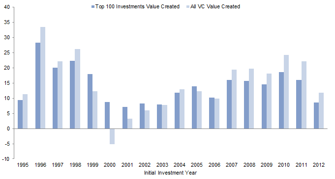

# Unicorn

Definition

Marktwert von >1 Milliarde USD

---

# Unicorn = $$$
It's weird

### https://www.cambridgeassociates.com/insight/venture-capital-disrupts-itself-breaking-the-concentration-curse/

---

# Unicornzwang

Vereinhornung

- VC is Risikokapital
  - Das wird nur in Zeug investiert, das sterben kann
  - Kein Risiko = es ist es nicht wert, das Geld zu investieren
- 75% (+- 15%) der Investments geben 0 Geld an Investoren zurück

**Aber:**

- Damit man sich das Leisten kann, **müssen** Risengewinne möglich sein.

## ==> VCs geben die Chance

---

# Failing
Anekdote

---

# PMF
Product Market Fit

Startups werden in 2 gruppen Verteilt:

- Pre-PMF
- Post-PMF

---

# PMF
Die Abwesenheit von Fragen

Wenn man was neues baut, dann weiß man nicht ob Leute das wollen.

Zahnartzt / Handwerker / Recruiter / ... ==> Nachfrage / Bedarf bekannt.

Gegenbeispiel:

### Man sieht, ich bin vorbereitet (es ist 14:16 als ich das schreibe)

---

### Wollen die Leute das überhaupt?

---

# Pre-PMF
Angel, Seed, Series A/B

- Wenn man PMF nicht hat, geht es darum, den PMF zu finden.
- Investoren wissen das auch.
  - d.H. anpassen von Geschäftsidee ist grundsätzlich akzeptiert
- Hauptziel: Wert schaffen ("create value" - "make the world a better place")

---

# Post-PMF
Series C, D, E, F => Growth

- Jetzt kennt man die Hebel
- Man weiß, wie man mehr Kunden / Nutzer kriegt
- Ziel:
  - Wert abschöpfen  ("capture value" - "get rich")
  - Marktdominanz

Test für PMF: "Wenn du plötzlich eine Million mehr Einnahmen brauchst, ist das einfach?"

---

# Who is worthy?

Wie entscheiden VCs wer Geld kriegt?

Schlussendlich: Haben die Lust drauf?

Aber, Grundsätzlich:

- Post PMF:
  - Metriken ("Verdienst du Geld")

- Pre PMF
  1. Problem 
    a. Potential Solution
  2. Timing ("Warum jetzt?")
  3. Team
  4. Traction
  5. Opportunity ("Wie viel $$$")

---

<video src="./assets/techstars.mp4" controls></video>

---

# Was ist wichtig

1. Nur wenige Firmen haben (historisch) den Löwenteil der Gewinne von VC erwirtschaftet

2. Konservative Firmen haben wenig Chancen

3. Es ist schwer zu vorherzuesehen, wer erfolgreich wird

4. Das Geld kriegen daher nur Firmen, die ein Geschäftsmodell haben, dass Risengewinne einfahren kann.

5. Nach dem Wachstum, wo Wert schaffen > $$$, verschiebt sich der Fokus auf $$$

---

# VC ist das objektiv beste Investment für Gründer

- Vergleich zu Staatliche Förderung:
  - Unbürokratisch
  - Kommt nicht von Steuerzahler
  - Hoher Betrag
  - Öffentliches Interesse

- Vergleich zu Darlehen / Kredit / Eigenkapital
  - Risikofrei für Gründer
  - Vergleichbar extrem zugänglich (auch ohne Reichtum erreichbar)
    - Mein Elternhaus ist nicht wohlhabend
    - Und auch wenig schwere Bürokratie

==> Es gibt einen Grund, warum so viele einflussreiche Unternehmen VC investment haben.

---

# Tja

Es ist schade, dass dieses Mittel nur für eine bestimmte Art an Firmen interessant ist.
