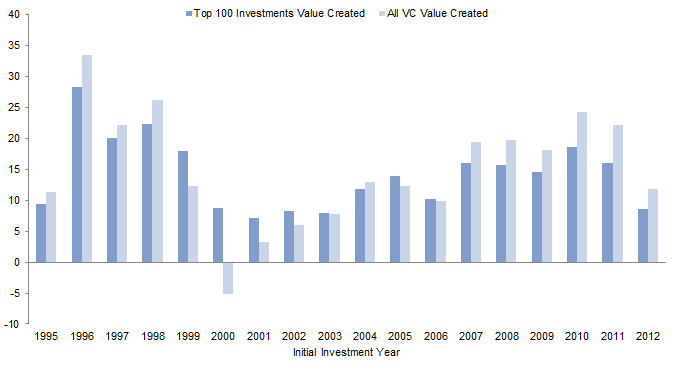
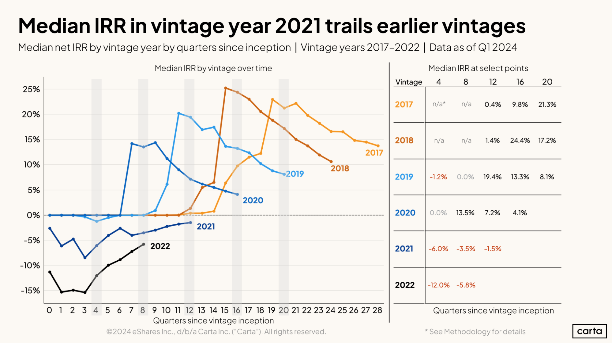
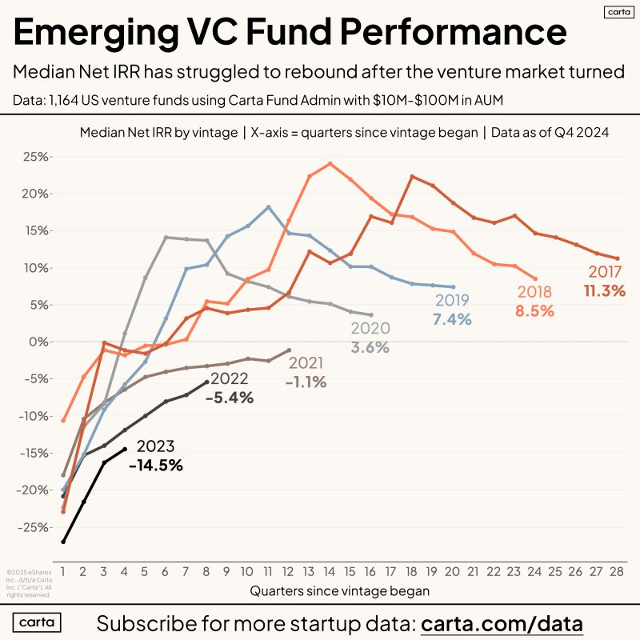
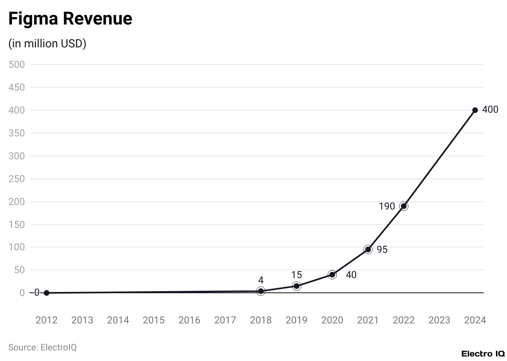

# Unicorn

Definition

Market cap of > 1 billion USD

---

# Unicorn = $$$
It's weird

### https://www.cambridgeassociates.com/insight/venture-capital-disrupts-itself-breaking-the-concentration-curse/

---

# Enforced Unicornity

Unicornation

- VC is high-risk investment
  - Only invested into stuff that can die
  - No risk => not worth investing into
- 75% (+- 15%) of investments return 0 value (dividends, exits, ...)

**But:**

- To afford this it's **necessary** that *some* investments can have insane returns.

## ==> VCs give *a chance* to succeed

---

# Failing
Anecdote

=> It's okay to fail. It's not okay to not try.

---

# Detour: VC does have issues

This is the reason why people invest - but VC does have some struggle recently.

---

# Let's look at Data

### https://carta.com/data/recent-vc-fund-performance-q3-2024/

---

# But #2

### https://www.saastr.com/carta-smaller-vc-returns-have-fallen-30-or-more-will-ai-boost-them-back/

---

# What do they say?

> There’s reason to think, however, that this current state of affairs won’t last forever. Investors believe that funds raised in the past few years might eventually come to be seen as some of the most attractive vintages in venture capital memory.

-- carta

My personal opinion (without hard numbers): In those years, there's been <i>a lot</i> of Web3/crypto investment.

🤔

I think silicon valley just isn't building what people want lol

---
layout: center
---

Part 2 - How startups work

---

# PMF
Product Market Fit

Startups can be split into 2 groups:

- Pre-PMF
- Post-PMF

---

# PMF
The absence of questions

If you're building something new, you don't know whether someone event cares.

Dentist / Plumber / Recruiter / ... ==> Demand / Need is well-known.

Gegenbeispiel:

---

### Do people want this thing even?

---

# Pre-PMF
Angel, Seed, Series A/B

- While you don't have PMF, all you do is trying to find PMF
- Investors get this
  - d.H. changing your idea / business ("pivoting") is generally possible
- Main goal: "create value" - "make the world a better place"

---

# Post-PMF
Series C, D, E, F => Growth

- You understand the levers
- You understand how to get customers easily
- Goal:
  - "capture value" (get rich)
  - market dominance

Test for PMF: "If you needed $1mn more revenue, could you do that easily?"

==> That's where all pre-PMF startups wanna go.

==> "Scaling" is a good problem to have.

---

# Who is worthy?

**In the end:** VCs give money to whoever they want to.

But:

- Post PMF:
  - metrics ("do you make money?" "are you capturing the market?")

- Pre PMF
  1. Problem 
    a. Potential Solution
  2. Timing ("Why now?")
  3. Team
  4. Traction
  5. Opportunity ("How much $$$")

==> The overall story is more important than *any* invidivual factor!!!!

---

<video src="./assets/techstars.mp4" controls></video>

<ol>
  <li>1. Problem 
  &nbsp;&nbsp;a. Potential Solution</li>
  <li>2. Timing ("Why now?")</li>
  <li>3. Team</li>
  <li>4. Traction</li>
  <li>5. Opportunity ("How much $$$")</li>
</ol>

---

# Important thought

If a VC is better at judging and evaluating, they get higher yields.

VCs with higher yields get more invesment and invest more.

==> Their criteria seem arbitrary, but they believe them to be the most successful set.

---

# Takeaways

1. A few companies were responsible for majority of VC profits.

2. Conservative companies ("safe bets") aren't worth it

3. It's hard to predict who's more successful, which makes safe bets even less attractive.

4. Only companies with the chance of outsized profits get VC investment.

5. After growth (where creating value > $$$), the focus shifts to capturing $$$ (getting rich).

---

# VC is the best investment you can get

- Compared to government grants:
  - little bureocracy
  - you're not wasting taxpayer money
  - high amounts
  - nobody cares if you fail

- compared to loans / credits / your own money
  - vc money has no personal risk
  - super accessible (you don't need to be rich to get it)
    - I grew up on Harz IV for a large chunk of my youth
  - Comparitively little burocracy (no super advanced business plan needed)

==> There's a reason that so many popular companies have had VC funding.

---

# Tja

It's sad that this model of funding only works for people who're willing to be greedy.

The (perceived?) ignorance of nerds towards this funding model, and how it influences the place we spend our time is frustrating.

(But hey, you're here to change it :))

---

# Questions + Thank

ari@aricake.eu

Slides will be at: https://slides.aricake.eu/vc-2/ (tomorrow)
