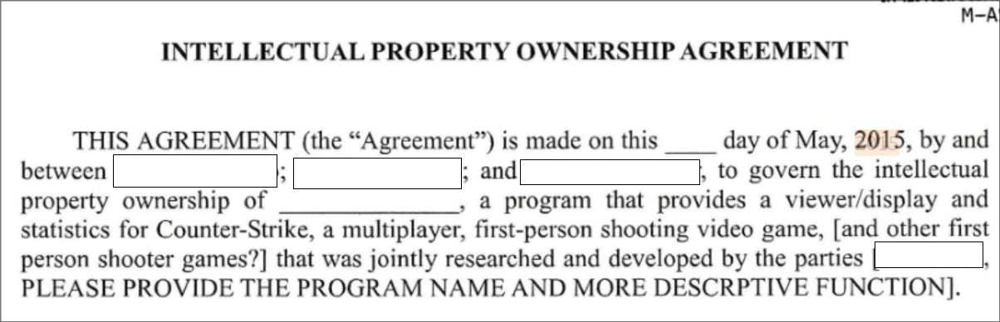
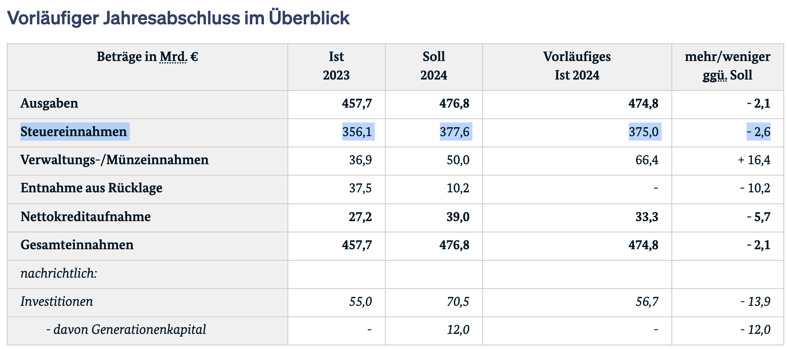
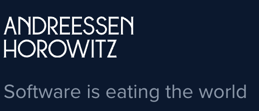
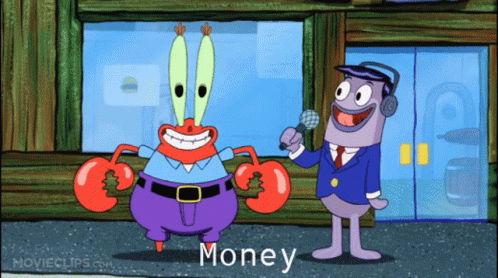
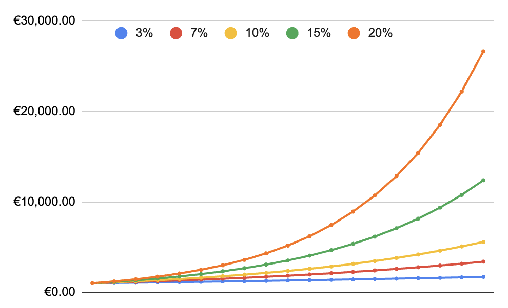
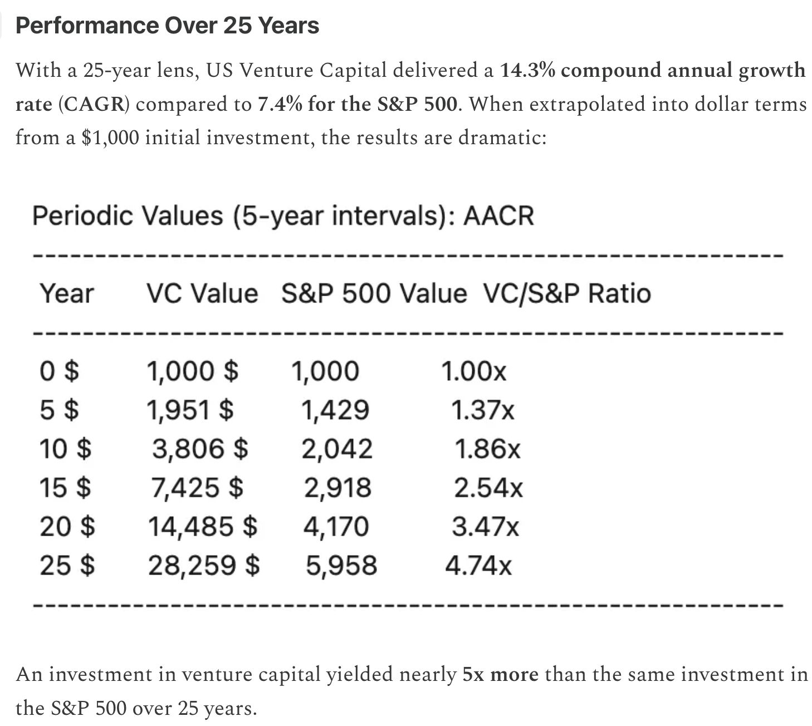
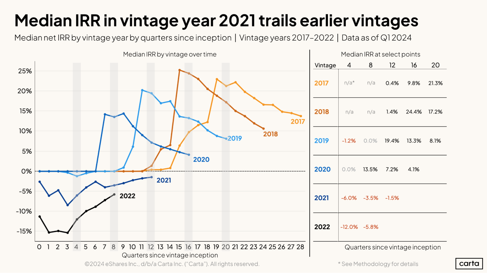

  

    Wie funktioniert eigentlich
  

  
    VC funding?
  

  

    Mega-Knowledgecamp 2025 
    ari@aricake.eu
  

---

# Wer?

- Gründer von mehreren Startups
  - 2015 erstes Startup gegründet
    
  - Seit dem bei 4 Startups gearbeitet (2 davon meine)
  - War bei TechStars
  - In 2022 insegesamt ~$4.000.000 USD an seed-funding erhalten
  - Das Startup existiert nicht mehr 💸

---

# Disclaimer

- Ich bin hier privat
  - Ich spreche nicht für voherige, aktuelle, oder zukünftige Arbeitgeber, Mitgründer, Kollegen, Investoren oder Friedrich Merz.

 

- "I'm not saying that is how it should be - I'm saying that is how it is"
  - Es geht darum VCs zu verstehen
  - Das bedeutet nicht, dass jeder Askpekt gut ist

 

- "Clever" != "Ethisch korrekt"
  - Ich werde Dinge als schlau / clever / cool / ... bezeichnen
  - Das bedeutet auch nicht, dass die ethisch gut sind

 

- Vieles vereinfacht
  - z.B. SAFE / Investment / Convertible Note => Egal

---

# Gliederung

1. Gliederung vorstellen

---

# Worum geht es?

1. Was ist ein Startup?
2. Wer zahlt das Geld? Was ist eine VC?
3. Warum?  
    a. 🦄
4. Product Market Fit
5. Investment
6. Welche Probleme gibt es im Moment?

<i class="light-icon-arrow-right flex"></i> Mein Versprechen: Wenn ihr das versteht, versteht ihr den Tech-Sektor <b><u>viel</u></b> besser.

---
layout: dynamic-image
equal: true
left: false
image: https://images.unsplash.com/photo-1649003515353-c58a239cf662?q=80&w=1740&auto=format&fit=crop&ixlib=rb-4.1.0&ixid=M3wxMjA3fDB8MHxwaG90by1wYWdlfHx8fGVufDB8fHx8fA%3D%3D
---

  Was ist Venture Capital?

We hat davon schon mal gehört?

---

# Startups != Kleines Unternehmen

  

    
Kleines Unternehmen

    
Handwerker, Zahnarzt, EDEKA Filiale, ...

    
Businessplan möglich

    
Start von Selbständigkeit

    
Ziel: "Job für's Leben"

    
Einkommen, Unabhängigkeit, ...

  

  

    
Startup

    
Fluxtaxi (Lillium), GitLab, GPU Cloud, ...

    
Product-Market-Fit Unbekannt

    
...mit dem Ziel, sehr viel Geld zu verdienen

    
Ziel: Skalieren + Verkaufen

    
 Disruption, Expansion, ...

  

### Anm.: Das ist nicht meine Meinung, sondern die Perspektive von VCs

---
layout: center
---

# Startups versuchen zu saklieren

---
layout: center
---

# Ziel ist zwingend: Kohle ohne Ende

---
layout: center
---

# Sonst ist es kein Startup.

---

# Geld

> Global VC investment rose from $349.4 billion across 43,320 deals in 2023 to $368.3 billion across 35,684 deals in 2024

Da wurden **313 Milliarden Euro** investiert. Vergleich: Steuereinahmen vom Bund

---

---

# Zusammenfassung

1. VCs erstellen "Funds"
2. Leute investieren in den Fund
3. Der Fund investiert in Startups
4. Wenn das Startup verkauft wird: $$$ für Fund

---

# Beispiel - Spezifischer Fund

Die American Dynamism-Praxis investiert in Gründer und Unternehmen, die das nationale Interesse (der USA) unterstützen: Luft- und Raumfahrt, Verteidigung, öffentliche Sicherheit, Bildung, Wohnungswesen, Lieferketten, Industrie und Fertigung. Wir glauben, dass missiongetriebene und zivilgesellschaftlich orientierte Gründer oft Unternehmen aufbauen, die Branchen und Geschäftsmodelle überschreiten, um wichtige nationale Probleme zu lösen. Diese Unternehmen sehen die Regierung als Kunden, Wettbewerber oder wichtigen Stakeholder – und der Erfolg dieser Unternehmen unterstützt das Gedeihen aller Amerikaner. Dynamische Unternehmen existieren in allen 50 Bundesstaaten und haben globale Wirkung.

Engl. Original: The American Dynamism practice invests in founders and companies that support the national interest: aerospace, defense, public safety, education, housing, supply chain, industrials, and manufacturing. We believe that mission-driven and civic-minded founders often build companies that transcend verticals and business models in their quest to solve important national problems. These companies view the government as a customer, competitor, or key stakeholder—and the success of these companies supports the flourishing of all Americans. Dynamic companies exist in all 50 states and have a global impact.

---

# Generische Funds

Viele VCs haben keine themenspezifischen Funds, sondern gruppieren z.B. nach Jahr (YCombinator), oder manchmal (afaik) auch gar nicht.

---

# Warum

Warum investieren die Leute Geld in VCs?

---

# So, das hier ist keine Finanzberatung

Aber schauen wir uns mal eine Exponentialfunktion an:

---

# Womit werben VCs?

### https://www.venturecapitai.com/p/25-years-of-outperformance-a-comparative

---

# Aber

### https://carta.com/data/recent-vc-fund-performance-q3-2024/

---

# Naja

Es gibt jedoch Gründe anzunehmen, dass dieser derzeitige Zustand nicht ewig anhalten wird. Investoren sind der Ansicht, dass die in den vergangenen Jahren eingeworbenen Mittel schließlich als einige der attraktivsten Jahrgänge in der Geschichte des Risikokapitals gelten könnten.

There’s reason to think, however, that this current state of affairs won’t last forever. Investors believe that funds raised in the past few years might eventually come to be seen as some of the most attractive vintages in venture capital memory.

<v-click >
Persönlicher Gedanke (ohne harte Zahlen): In den Jahren war schon sehr viel Crypto / Web3 Investment da.

🤔

</v-click>

---

# Leitgedanke von VC investment

- "Startups, als Assetklasse, outperform normale Aktionfonds."
  - Wenn man in mehrere Fonds investiert, dann ist das Risiko überchaubar
  - Medium-Risko, Riesen Gewinne.
  - Und normalos haben nicht wirklich Zugriff darauf

- Plus: Mann kann sich sogar gut fühlen
  - Startups schöpfen wert, sie machen die Welt besser
  - Es ist kein Nullsummenspiel, es muss keine Verlierer geben
  - Beispiel: Google (Suchmaschine)

---

# Einhörner

Was ist ein Einhorn (aus VC perspektive)?

 ✨🌈🦄
🌈
✨

unicode unicorn

