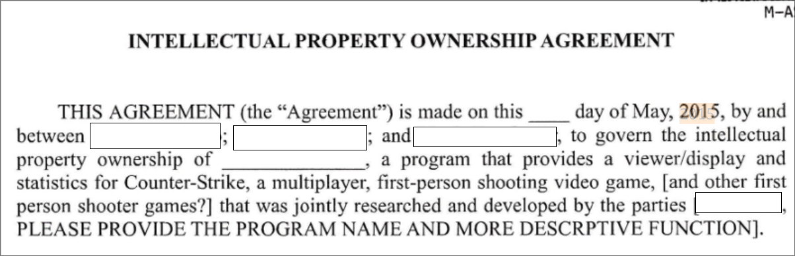
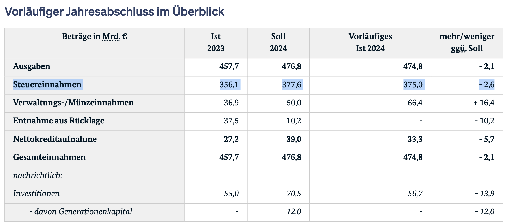
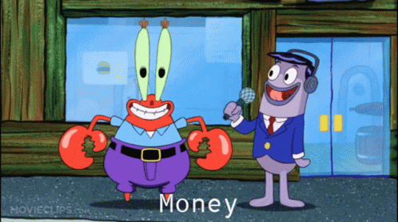
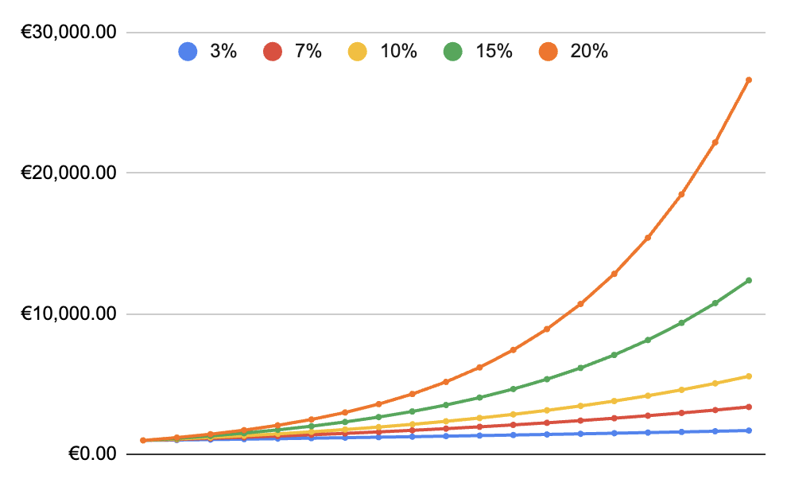
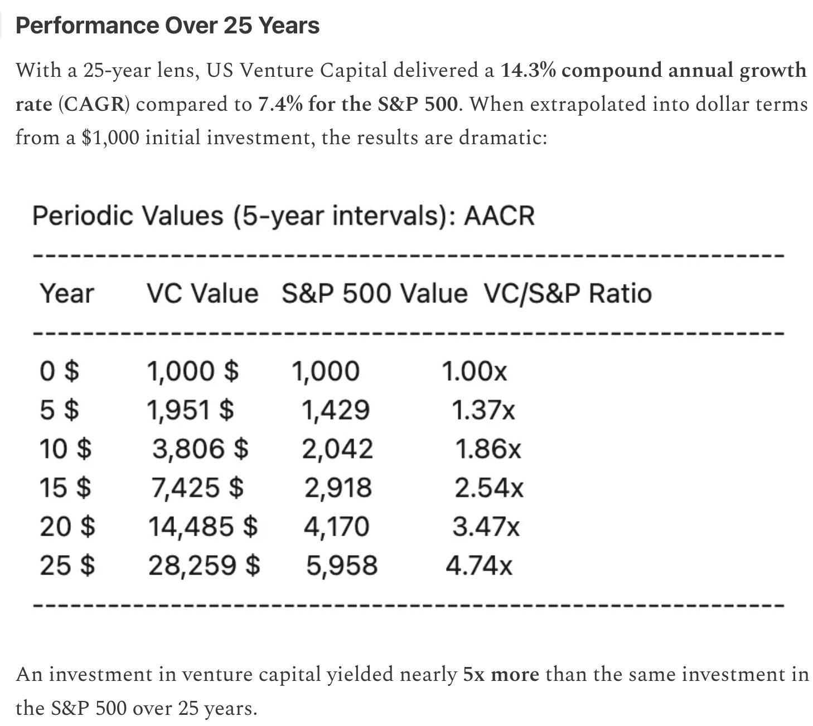

  
    How does VC funding work, actually?
  
  

    Or: "Money, money, I like money."
  

  

    39c3 - SoS - Day 1 
    ari@aricake.eu
  

---
src: logos.md
---

---

# Who?

- Founded 2 startups
- First 2015
  
- Worked for four startups since (2 my own)
- Attended TechStars, a startup accelerator*
- Raised ~4 million USD in in 2022

<ul>
<v-click>
  <li> ...the startup is dead now 💸</li>
</v-click>
<v-click>
  <li>but that's fine!</li>
</v-click>
</ul>

---

# Disclaimer

- I'm only representing myself here!
  - I'm not speaking for previous, current or future employers, co-founders, colleagues, investors, or Friedrich März.

 

- "I'm not saying that is how it should be - I'm saying that is how it is"
  - The goal is to understand VCs

 

- "Clever" != "Ethical"

 

- I'm simplifying *a lot*
  - e.G. SAFE vs. Investment vs. Convertible Note => Who cares?
  - Rule of thumb: if you move more than $10M USD, you're involving lawyers.
  - Lawyers are just as bad as software engineers at overcomplicating things.

---

# Goal

My company failed, but nobody's mad - why?

1. What's a startup?
2. Where does the money come from and go to?
3. Why?  
    a. 🦄
4. Product Market Fit
5. Investment
6. Why VC funding is so cool*

<i class="light-icon-arrow-right flex"></i> Promise: If you undestand everything in this talk, you'll understand the tech industry <b><u>so much</u></b> more.

---
layout: dynamic-image
equal: true
left: false
image: https://images.unsplash.com/photo-1649003515353-c58a239cf662?q=80&w=1740&auto=format&fit=crop&ixlib=rb-4.1.0&ixid=M3wxMjA3fDB8MHxwaG90by1wYWdlfHx8fGVufDB8fHx8fA%3D%3D
---

  Define: Venture Capital?

Who wants to try?

---

# Definition

Every definition is incorrect, but:

- Venture capital is a form of **private equity financing**
  - **provided by firms or funds**
  - to **startup, early-stage, and emerging companies**
    - that have been deemed to have high growth potential or
    - that have demonstrated high growth in terms of number of employees, annual revenue, scale of operations, etc.

So:

- Funding for startups
- Private investors (not everyone can invest)
- *Could* grow a lot

---

# Startups != Small / Medium-Sized Businesses (SMB)

Note: This isn't *my* opinion - that's the view of VCs

  

    
SMBs

    
Contractor, Dentist, EDEKA Store, ...

    
Clear business plan

    
self-employment

    
Goal: "job for life"

    
income, independence, sustainability, ...

  

  

    
Startup

    
"Flight taxis" (Lillium), B2B SaaS, Biotech,...

    
Product-Market-Fit unknown

    
...with the goal to make $$$

    
Goal: scale + sell

    
 disruption, market dominance, ...

  

---
layout: center
---

# Startups try to scale

---
layout: center
---

# Necessary goal: finding an infinite money glitch

---
layout: center
---

# Otherwise, it's not a startup

---

# Geld

> Global VC investment rose from **$349.4 billion** across 43,320 deals in 2023 to **$368.3 billion** across 35,684 deals in 2024

In 2024, VC investment was **313bn Euro** in 2024. Comparision: Tax income of the German Federal Government:

---

---

# Zusammenfassung

1. VCs create "funds", a "holding company"
2. Rich people invest into said funds
3. Said fund invests into startups
4. If startup sells: $$$ for the fund

---

# Example fund: specific purpose
By a16z, one of the biggest VCs

The American Dynamism practice invests in founders and companies that support the national interest: aerospace, defense, public safety, education, housing, supply chain, industrials, and manufacturing. We believe that mission-driven and civic-minded founders often build companies that transcend verticals and business models in their quest to solve important national problems. These companies view the government as a customer, competitor, or key stakeholder—and the success of these companies supports the flourishing of all Americans. Dynamic companies exist in all 50 states and have a global impact.

---

# Generic funds

&nbsp;

Many VCs don't have specialized/purpose-bound funds, but might allow investors to invest by years and geogaphies (afaik TechStars, YCombinator).

Some VCs just have a generic fund, not really bound to a specific purpose or time.

Remember: Lawyers can get very creative.

---

# Why tho?

Why do people invest into VCs?

---

# Not financial advice:

But there's a reason VC bros call everything "exponential". Look at this graph:

Over ~20 years, insane difference between 10% and 20% growth!

---

# What do VCs advertise with?

### https://www.venturecapitai.com/p/25-years-of-outperformance-a-comparative

---

# The ideas of VC investment

Note: still not financial advice :)

- "Startups, als asset class, outperform most stock portfolios and index funds."
  - if you invest into multiple vc funds, your risk *tends* to be lower
    - If you invest in 10 funds, and each fund invests into 25 new companies, you invested into 250 companies -> law of averages applies.
  - So: medium-risk, high yield, yay!
  - normal people don't really have access to the funds

---

# Ideological advantages

You can feel good about your investment!

- Startups *create value* (they make the world a better place)
- It's not a zero-sum game - your wins aren't necessarily someone else's losses
  - Compare: stock market, every $ you make, someone else loses.
- Example: Google search
  - It created more value for the world than Google investors made
  - "Benefits humanity"

---

# Unicorns

What's a unicorn?

 ✨🌈🦄
🌈
✨

unicode unicorn

---
src: ./part2.md
---
